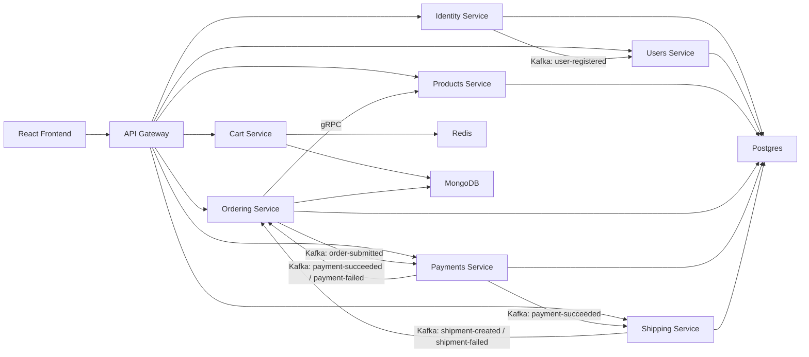

# MicroCommerce

MicroCommerce is a `.NET 10` ecommerce microservices sample built without Aspire so you can see the plumbing directly. The project is backend-first and is designed to demonstrate how multiple services, databases, and messaging patterns fit together in a realistic but approachable local setup.

The solution includes:

- multiple backend microservices
- an API gateway
- a lightweight React frontend for testing flows
- Kafka-based integration events
- gRPC between internal services where it makes sense
- polyglot persistence with Postgres, MongoDB, and Redis
- a simple saga-based order workflow

## What the application does

The sample models a small ecommerce platform with these domains:

- `Products`
- `Ordering`
- `Shipping`
- `Payments`
- `Users`
- `Shopping Cart`
- `Identity`

The intended user flow is:

1. Register or log in through `Identity`
2. Browse products
3. Add items to the cart
4. Submit an order
5. Let the order trigger an event-driven payment and shipping workflow
6. Query the order status through the read model

## Why `Identity` is separate from `Users`

`Identity` and `Users` are separate on purpose.

- `Identity` handles authentication concerns: credentials, password validation, and JWT issuance
- `Users` handles customer profile data and acts as a read-side/profile service

That separation keeps auth concerns isolated from broader customer data and mirrors how many real systems evolve.

## High-Level Architecture



## Architectural choices

### Communication style

- Client to gateway: `REST`
- Gateway to services: `REST`
- Service-to-service internal call: `gRPC` where low-latency contract-based interaction is useful
- Service-to-service async integration: `Kafka`

### Persistence style

- `Postgres`
  - relational persistence
  - transaction-oriented service data
  - event stream storage for ordering
- `MongoDB`
  - read models and flexible document projections
  - cart snapshot persistence
  - order read-side projection
- `Redis`
  - fast cart access
  - cache-like basket behavior

### Event-driven design

Kafka is used for integration events so services stay decoupled. The sample uses events for:

- user registration projection
- order submission
- payment success/failure
- shipment success/failure

### Event sourcing

`Ordering` is the main event-sourced service in this sample.

- writes are stored as events in `order_events`
- current query shape is projected into MongoDB
- saga state is tracked in Postgres

### Saga pattern

The order lifecycle is modeled as a simple saga:

1. `Ordering` publishes `ordering.order-submitted`
2. `Payments` consumes it and either approves or rejects payment
3. `Shipping` creates a shipment after a successful payment
4. `Ordering` consumes downstream events and updates the order status

### Idempotency

Orders use a SHA-256 based hash derived from:

- user id
- normalized shipping address
- normalized order lines

This is used to support idempotency for order submission logic.

## Service breakdown

### `Gateway`

Location: `src/Gateway/MicroCommerce.ApiGateway`

Responsibilities:

- single public entrypoint for the client
- forwards REST calls to downstream services
- keeps the frontend from needing to know every service URL

### `Identity`

Location: `src/Services/Identity/MicroCommerce.Identity.Api`

Responsibilities:

- user registration
- login
- JWT token creation
- publishes `identity.user-registered`

Persistence:

- Postgres

### `Users`

Location: `src/Services/Users/MicroCommerce.Users.Api`

Responsibilities:

- customer profile read service
- consumes `identity.user-registered`

Persistence:

- Postgres

### `Products`

Location: `src/Services/Products/MicroCommerce.Products.Api`

Responsibilities:

- REST catalog endpoints
- gRPC product lookup for ordering
- seeded sample catalog

Persistence:

- Postgres

### `Cart`

Location: `src/Services/Cart/MicroCommerce.Cart.Api`

Responsibilities:

- cart CRUD endpoints
- fast basket retrieval from Redis
- snapshot persistence in MongoDB

Persistence:

- Redis
- MongoDB

### `Ordering`

Location: `src/Services/Ordering/MicroCommerce.Ordering.Api`

Responsibilities:

- place orders
- call `Products` via gRPC to validate and snapshot product data
- store order events
- maintain saga state
- project read models to MongoDB
- consume payment/shipping events

Persistence:

- Postgres
- MongoDB

### `Payments`

Location: `src/Services/Payments/MicroCommerce.Payments.Api`

Responsibilities:

- simulate payment processing
- consume `ordering.order-submitted`
- publish success/failure events

Persistence:

- Postgres

### `Shipping`

Location: `src/Services/Shipping/MicroCommerce.Shipping.Api`

Responsibilities:

- simulate shipment creation
- consume payment success events
- publish shipment success/failure events

Persistence:

- Postgres

## Event topics

The main Kafka topics used by the sample are:

- `identity.user-registered`
- `ordering.order-submitted`
- `payments.payment-succeeded`
- `payments.payment-failed`
- `shipping.shipment-created`
- `shipping.shipment-failed`

## Repository layout

```text
.
├── src
│   ├── BuildingBlocks
│   │   ├── MicroCommerce.SharedKernel
│   │   ├── MicroCommerce.Contracts
│   │   └── MicroCommerce.Infrastructure
│   ├── Gateway
│   │   └── MicroCommerce.ApiGateway
│   └── Services
│       ├── Identity
│       ├── Users
│       ├── Products
│       ├── Cart
│       ├── Ordering
│       ├── Payments
│       └── Shipping
├── frontend
│   └── web
└── docker
```

## Running the project

### Prerequisites

- Docker Desktop or Rancher Desktop with Docker Compose support
- `.NET SDK 10.0.103` or later
- Node `22` if you want to run the frontend outside Docker

### Run everything with Docker

From the repository root:

```bash
docker compose up --build
```

This starts:

- all backend services
- the API gateway
- the React frontend
- Postgres
- MongoDB
- Redis
- Zookeeper
- Kafka

### Important local URLs

- Frontend: `http://localhost:3080`
- Gateway: `http://localhost:5080`
- Identity: `http://localhost:6001`
- Users: `http://localhost:6002`
- Products REST: `http://localhost:6003`
- Products gRPC: `http://localhost:6103`
- Cart: `http://localhost:6004`
- Ordering REST: `http://localhost:6005`
- Ordering gRPC: `http://localhost:6105`
- Payments: `http://localhost:6006`
- Shipping: `http://localhost:6007`
- Postgres: `localhost:5432`
- MongoDB: `localhost:27017`
- Redis: `localhost:6379`
- Kafka external listener: `localhost:29092`

## Rider-friendly local development

If you are building one microservice at a time in Rider, the best workflow is:

1. Run only infrastructure in Docker
2. Run the microservice you are editing from Rider
3. Keep the other services either stopped or running in Docker as needed

### Start only infrastructure

Use the infra-only compose file:

```bash
docker compose -f docker-compose.infra.yml up -d
```

This starts only:

- Postgres
- MongoDB
- Redis
- Zookeeper
- Kafka

### Stop only infrastructure

```bash
docker compose -f docker-compose.infra.yml down
```

### Recommended Rider workflow

- Start infra with `docker-compose.infra.yml`
- Open `MicroCommerce.slnx` in Rider
- Create a `.NET Project` run configuration for the service you want to edit
- Run that service from Rider with breakpoints/debugging
- Run other services only when you need them

Example:

- keep Kafka, Postgres, MongoDB, and Redis running in Docker
- run `Ordering` from Rider while editing order flow code
- run `Products` from Docker, or start it from Rider too if you are changing both sides of the gRPC call

### Useful service entrypoints in Rider

- `src/Services/Identity/MicroCommerce.Identity.Api`
- `src/Services/Users/MicroCommerce.Users.Api`
- `src/Services/Products/MicroCommerce.Products.Api`
- `src/Services/Cart/MicroCommerce.Cart.Api`
- `src/Services/Ordering/MicroCommerce.Ordering.Api`
- `src/Services/Payments/MicroCommerce.Payments.Api`
- `src/Services/Shipping/MicroCommerce.Shipping.Api`
- `src/Gateway/MicroCommerce.ApiGateway`

### Notes for hybrid local development

- The infra-only compose file is the best starting point for Rider work
- Kafka is exposed on `localhost:29092`
- Postgres is exposed on `localhost:5432`
- MongoDB is exposed on `localhost:27017`
- Redis is exposed on `localhost:6379`
- The full `docker-compose.yml` is still the easiest way to run the entire system end to end

### Developer workflow when switching microservices

When you are editing one microservice in Rider and then want Docker to pick up your changes before you move on to another service, use this loop:

1. Start infrastructure:

```bash
docker compose -f docker-compose.infra.yml up -d
```

2. Run the microservice you are actively editing from Rider
3. Make and test your changes locally
4. Stop that microservice in Rider when you are done
5. Rebuild and restart just that service in Docker:

```bash
docker compose up --build -d <service-name>
```

Examples:

```bash
docker compose up --build -d ordering-api
docker compose up --build -d products-api
docker compose up --build -d identity-api
```

If you changed more than one service, you can rebuild a few together:

```bash
docker compose up --build -d ordering-api products-api payments-api
```

If you want Docker to refresh the whole application again:

```bash
docker compose up --build -d
```

Important:

- do not run the same microservice in Rider and Docker at the same time on the same port
- while editing a service, prefer Rider
- when done, stop it in Rider and bring it back into Docker with `docker compose up --build -d <service-name>`

## Suggested demo flow

Once the stack is up:

1. Open the frontend at `http://localhost:3080`
2. Register a user
3. Log in
4. Browse the seeded products
5. Add items to the cart
6. Submit an order
7. Inspect order, payment, and shipping services through their REST endpoints if needed

## Running pieces individually

If you want to experiment service-by-service instead of running Docker first, the main entrypoints are:

- `src/Gateway/MicroCommerce.ApiGateway`
- `src/Services/Identity/MicroCommerce.Identity.Api`
- `src/Services/Users/MicroCommerce.Users.Api`
- `src/Services/Products/MicroCommerce.Products.Api`
- `src/Services/Cart/MicroCommerce.Cart.Api`
- `src/Services/Ordering/MicroCommerce.Ordering.Api`
- `src/Services/Payments/MicroCommerce.Payments.Api`
- `src/Services/Shipping/MicroCommerce.Shipping.Api`

Typical command pattern:

```bash
dotnet run --project src/Services/Products/MicroCommerce.Products.Api
```

You will still need the infrastructure services running locally:

- Postgres
- MongoDB
- Redis
- Kafka
- Zookeeper

## Notes and limitations

- `Payments` and `Shipping` are intentionally simulated so you can focus on flow and architecture.
- Database bootstrapping currently uses `EnsureCreated()` for simplicity.
- For a production-style next step, replace that with real migrations per service.
- Zookeeper is included because it keeps local Kafka setup simple for learning.
- The sample is intentionally educational rather than fully production-hardened.

## Next improvements

Good next steps if you want to keep growing the project:

- add EF Core migrations per service
- add retries, dead-letter handling, and more robust compensations
- add observability with structured logging and tracing
- introduce an outbox pattern for more durable event publishing
- expand the frontend into a richer admin/test console
